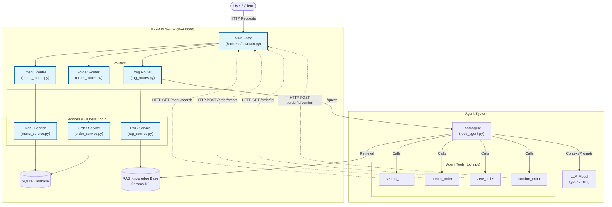

```mermaid 
graph TD
    User([User / Client])
    
    subgraph "FastAPI Server (Port 8000)"
        MainEntry["Main Entry\n(Backend/api/main.py)"]
        
        subgraph "Routers"
            RouterMenu["/menu Router\n(menu_routes.py)"]
            RouterOrder["/order Router\n(order_routes.py)"]
            RouterRAG["/rag Router\n(rag_routes.py)"]
        end
        
        subgraph "Services (Business Logic)"
            SvcMenu["Menu Service\n(menu_service.py)"]
            SvcOrder["Order Service\n(order_service.py)"]
            SvcRAG["RAG Service\n(rag_service.py)"]
        end
        
        DB[(SQLite Database)]
        KB[(RAG Knowledge Base\nChroma DB)]
    end
    
    subgraph "Agent System"
        Agent["Food Agent\n(food_agent.py)"]
        LLM["LLM Model\n(gpt-4o-mini)"]
        
        subgraph "Agent Tools (tools.py)"
            ToolSearch["search_menu"]
            ToolCreate["create_order"]
            ToolView["view_order"]
            ToolConfirm["confirm_order"]
        end
    end

    %% Flow Definitions
    User -->|HTTP Requests| MainEntry
    
    MainEntry --> RouterMenu
    MainEntry --> RouterOrder
    MainEntry --> RouterRAG
    
    %% Direct API Usage
    RouterMenu --> SvcMenu
    RouterOrder --> SvcOrder
    RouterRAG --> SvcRAG
    
    SvcMenu --> DB
    SvcOrder --> DB
    SvcRAG --> KB
    
    %% Agentic Flow
    RouterRAG -->|"/query"| Agent
    Agent -->|Context/Prompts| LLM
    Agent -->|Retrieval| KB
    
    Agent -->|Calls| ToolSearch
    Agent -->|Calls| ToolCreate
    Agent -->|Calls| ToolView
    Agent -->|Calls| ToolConfirm
    
    %% Tools Loopback (Interesting Pattern)
    ToolSearch -.->|HTTP GET /menu/search| MainEntry
    ToolCreate -.->|HTTP POST /order/create| MainEntry
    ToolView -.->|HTTP GET /order/id| MainEntry
    ToolConfirm -.->|HTTP POST /order/id/confirm| MainEntry

    classDef server fill:#e1f5fe,stroke:#01579b,stroke-width:2px;
    classDef agent fill:#f3e5f5,stroke:#4a148c,stroke-width:2px;
    classDef db fill:#fff3e0,stroke:#e65100,stroke-width:2px;
    
    class MainEntry,RouterMenu,RouterOrder,RouterRAG,SvcMenu,SvcOrder,SvcRAG server;
```
    class Agent,LLM,ToolSearch,ToolCreate,ToolView,ToolConfirm agent;
    class DB,KB db;
